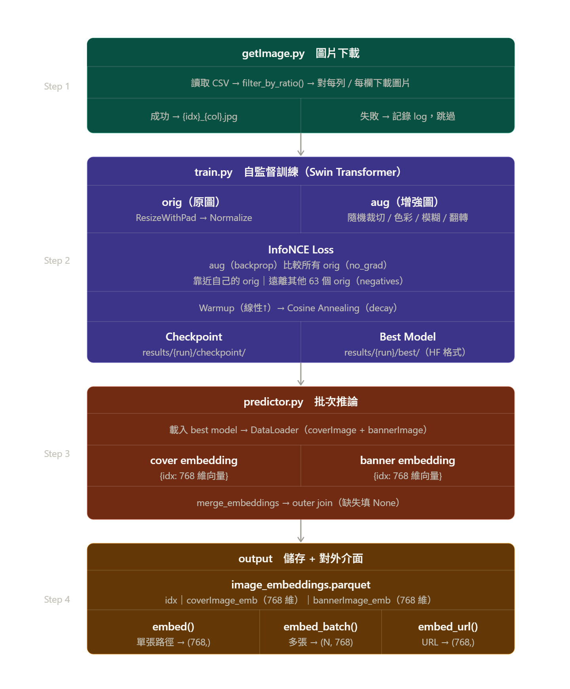

# 工作流程/方法說明

## 目標說明
本次專案，最主要的目標為 ```新番動畫播出前熱度預測 (Pre-release Anime Popularity Prediction Based on Multimodal Features)```。但在這份文件中，我們需要**專注**的內容為影像處理。如何將影像穩定的轉成一個向量，是本次文件的主要任務。

## 需要用到的內容

- 根據資料前處理的文件(```docs/handleoff_image_model.md```)中，已有說明要使用的檔案名稱和欄位，以下為參考使用的檔案位置和欄位:
    - 檔案位置: `data/processed/anilist_anime_multimodal_input_v1.csv`
    - 圖像欄位:
        - `coverImage_medium`（主圖）
        - `bannerImage`（輔助圖）
        - `trailer_thumbnail`（目前不打算使用）

- 將圖像轉換成向量的模型:
    - swin transformer (來源: Hugging Face `transformers`，模型：`microsoft/swin-base-patch4-window7-224`)
    - **其他內容將會手動補充**

- 網路爬蟲:
    - 根據給定的url抓取，設計成一個模組，隨時抓取


## 影像處理的架構和位置
>[! 該架構會隨日後需要擴充和調整而改變，以下為目前的初步規劃]

```
project_root/
├── config.yaml        # 設定模型、圖片處理參數、檔案輸入輸出路徑等
├── utils/             # 存放 function 和 class 的程式碼
├── main.py            # 主程式
└── results/
    ├── 01/
    │   ├── checkpoint/    # 第 1 次微調的模型權重
    │   └── best/          # 第 1 次微調中表現最好的權重
    ├── 02/
    │   ├── checkpoint/    # 第 2 次微調的模型權重
    │   └── best/          # 第 2 次微調中表現最好的權重
    └── .../

>[! 照片的部分會先存在 data/image下]
```


## 使用到的工具
>[! 以下工具需隨時更新，根據實際使用的工具和版本進行調整]

- numpy
- pandas
- torch (這部份如果需要，請先用 ```nvidia-smi``` 確認 版本和 GPU 的狀況， 並根據需要創建conda 環境) 
    >[! 任何的AI工具在這部分皆須詢問是否需要安裝conda 和確認 GPU 的狀況，並且在安裝前先確認版本和相容性，避免安裝後出現問題。]
- transformers
- requests (用於爬蟲)
- tqdm (用於顯示模型進度)- dghs-imgutils (用於 YOLO 動畫人物偵測，`pip install dghs-imgutils --no-deps`)

## 工作流程
>[! 以下工作流程需隨時更新，根據實際使用的流程和需求進行調整]

### 執行順序
```
getImage.py → yolo_for_image.py → train.py → predictor.py → output.py（日後使用）
```

---

### getImage.py
```
image_process_config.yaml
    ↓
load_config()
    ↓
read CSV → filter_by_ratio(df, ratio)
    ↓
for each row × each col (coverImage_medium, bannerImage):
    fetch_one(url, save_path)
        ├── 成功 → 存 {idx}_{col}.jpg → log_result(success)
        └── 失敗 → log_result(error)，跳過
```

---

### yolo_for_image.py
```
yolo_config.yaml
    ↓
load_config()
    ↓
getImage_YOLO(config, col) ← 讀 fetch_log.csv，取 status=success 的列
    ↓
for each row:
    url = row['url']
    下載圖片（requests.get）→ PIL Image
    upscale 至 640px（小圖提升偵測率）
    detect_person(img) → results
    依信心分數排序，取前 max_persons 個
        ├── 有偵測 → crop 並儲存到 output_dir
        └── 無偵測 → fallback 用整張圖
    show_crops() → 儲存 matplotlib canvas（原圖 + crops）
```

---

### train.py
```
load_config() → load_model(config)
    ↓
建立 train / val / test DataLoader（各自傳入對應 df、image_col）
    ↓
┌──────────────── __getitem__ ────────────────┐
│ load_image({idx}_{col}.jpg)                 │
│     ↓                                       │
│ ResizeWithPad(224)   ← 共用前置步驟         │
│     ↓               ↓                       │
│ transform_orig      transform_aug           │
│ ToTensor            RandomResizedCrop(224)  │
│ Normalize           RandomCrop(224,pad=22)  │
│                     ColorJitter    p=0.8    │
│                     GaussianBlur   p=0.5    │
│                     RandomHFlip    p=0.5    │
│                     RandomGrayscale p=0.2   │
│                     ToTensor                │
│                     Normalize               │
│     ↓               ↓                       │
│     (orig_tensor, aug_tensor, idx)          │
└─────────────────────────────────────────────┘
    ↓
─── Training loop ───────────────────────────────────────────
每 epoch：
    _forward_orig(orig) → torch.no_grad() → orig_emb（anchor）
    _forward_aug(aug)   → grad            → aug_emb
    infonce_loss(aug_emb, orig_emb, tau)  → loss
    backprop → optimizer.step() → scheduler.step()

    scheduler（Warmup + Cosine Annealing）：
        epoch 1 ~ warmup_epochs   : lr 從 0 線性升到 learning_rate
        epoch warmup_epochs ~ end : lr cosine decay 到 ~0

每 val_interval epoch：
    validate() → _val_step → infonce_loss（no backprop）→ avg val_loss
    log_metrics(train_loss, val_loss, cosine_sim, lr) → TensorBoard

─── 模型儲存 ────────────────────────────────────────────────
    val_loss 改善時
        → save_best(model, path)
        → model.save_pretrained()
        → results/{run_id}/best/        ← HuggingFace 格式，可直接 from_pretrained 載入

    每 checkpoint_interval epoch
        → save_checkpoint(model, optimizer, epoch, path)
        → results/{run_id}/checkpoint/epoch_{N}.pt  ← 含 optimizer 狀態，可續訓

─── Test ────────────────────────────────────────────────────
    evaluate_similarity() → avg cosine_similarity(orig_emb, aug_emb)
    結束 → close_writer()
```


---

### predictor.py（test set）
```
load model from results/{run_id}/best/
    ↓
建立 test DataLoader（coverImage_medium）
    use_yolo 由 yolo_config.yaml['yolo']['use'] 控制
    ↓
predict_one_col(model, loader):
    Tensor 路徑: 直接 forward → {idx: emb}
    YOLO  路徑: 逐樣本 mean pool 後 → {idx: emb}
    → cover_embs
    ↓
建立 test DataLoader（bannerImage）
    ↓
predict_one_col → banner_embs
    ↓
merge_embeddings(cover_embs, banner_embs)
    → outer join，缺失填 None
    → DataFrame: [idx, coverImage_emb, bannerImage_emb]
    ↓
save_embeddings() → data/processed/image_embeddings.parquet
```

---

### output.py（日後使用）
```
ImageEmbedder(model_path, config)
    → load model from results/{run_id}/best/
    → transform_orig（ResizeWithPad → ToTensor → Normalize）
    → model.eval()

embed(image_path)
    → load_image → ResizeWithPad → transform_orig → forward → (1024,) numpy

embed_batch(image_paths)
    → 逐張 load → stack batch → forward → (N, 1024) numpy

embed_url(url)
    → 下載到 tempfile → embed() → (1024,) numpy
```

---

### InfoNCE loss 說明
- `L = -log( exp(sim(aug, orig) / τ) / Σ exp(sim(aug, all_orig) / τ) )`
- `sim()` 為 cosine similarity；`τ`（temperature）預設 0.07
- batch 內其他圖片的 original embedding 自動作為 negative（batch size 64，每張圖有 63 個 negative）
- 防止 representation collapse：加入 negative 後模型必須區分不同圖片

---

### step4：輸出 embedding
- 儲存為**單一 parquet 檔**：`data/processed/image_embeddings.parquet`
- 欄位：`idx`、`coverImage_emb`（1024 維）、`bannerImage_emb`（1024 維）
    - `idx` 為 **AniList 動畫 ID**（來自 CSV 的 `id` 欄位），**不是** DataFrame 的 row index
- 讀取：`np.array(df["coverImage_emb"].tolist())` → shape `(N, 1024)`
- 可直接用 `idx` 和原本 CSV 以 `id` 欄位 merge

## 各 Function 設計簡介和說明

### 檔案結構

```
project_root/
├── src/
│   ├── config.py        # 讀取 yaml 設定（load_config, load_yolo_config）
│   ├── model.py         # 載入 Swin Transformer、取得 embedding
│   ├── loss.py          # InfoNCE loss
│   └── YOLO.PY          # detect_person wrapper（imgutils 公開 API）
├── util/
│   ├── getImage.py      # 爬蟲、圖片下載、getImage_YOLO
│   ├── image_process.py # transform pipeline、ResizeWithPad
│   ├── dataset.py       # Dataset class、yolo_collate_fn、get_dataloader
│   ├── train.py         # _pool_embeddings、訓練、驗證、存檔、TensorBoard
│   ├── yolo_for_image.py # YOLO 偵測 + 裁切 + canvas 輸出
│   └── predictor.py     # 批次 inference → parquet
├── output.py            # 對外推論介面（ImageEmbedder class）
├── image_process_config.yaml  # Swin 訓練設定
├── yolo_config.yaml           # YOLO 偵測設定
└── main.py
```

---

### src/config.py
- `load_config(config_path)` → 讀取 `image_process_config.yaml`，回傳 dict
- `load_yolo_config(config_path)` → 讀取 `yolo_config.yaml`，回傳 dict

### src/model.py
- `load_model(config)` → 從 HuggingFace 載入 SwinModel（pretrained），回傳 model（無 classifier head）
- `get_embedding(model, pixel_values)` → forward pass，取 pooler_output，回傳 shape `(B, 1024)` tensor

### src/loss.py
- `infonce_loss(aug_emb, orig_emb, tau)` → 計算 cosine similarity matrix，套用 InfoNCE 公式，回傳 scalar loss

---

### src/YOLO.PY
- `detect_person(image, level, version, conf_threshold, iou_threshold)` → 呼叫 `imgutils.detect.detect_person`，回傳 `List[((x0,y0,x1,y1), 'person', conf)]`
- 依賴 `deepghs/anime_person_detection`，預設 level=`m`、version=`v1.1`

---

### util/getImage.py
- `make_image_dir(image_dir)` → 確認資料夾存在，不存在則建立
- `fetch_one(url, save_path, timeout)` → 抓單張圖片存檔，成功回傳 True，失敗回傳 False
- `log_result(log_path, idx, col, url, status)` → 寫一行到 fetch_log.csv
- `filter_by_ratio(df, ratio, seed=42)` → 隨機取 ratio 比例的列，回傳篩選後 df
- `getImage(config)` → 讀 CSV → `filter_by_ratio()` → `fetch_one()` for each row/col
    - 命名規則：`{idx}_{col}.jpg`（e.g. `123_coverImage_medium.jpg`）
- `getImage_YOLO(config, col)` → 讀 `fetch_log.csv`，達滿 `col==col_name AND status==success`，回傳 df

### util/image_process.py

**ResizeWithPad（class）**：保留完整畫面，不裁切
```
scale = target_size / max(w, h)   ← 以最長邊為基準
new_w, new_h = int(w*scale), int(h*scale)
img.resize((new_w, new_h))        ← 等比縮放
pad 左右 or 上下至 target_size    ← 補黑邊
```

- `get_transform_original(image_size)` → Compose: ToTensor → Normalize(ImageNet)（ResizeWithPad 已在 __getitem__ 完成）
- `get_transform_aug(config)` → 呼叫所有 `_make_*` helper，組成最終 Compose
    - `_make_crop(config)` → RandomResizedCrop(scale=[0.8,1.0], ratio=[0.85,1.18])，p=1.0
    - `_make_random_crop(config)` → RandomCrop(224, padding=int(224 * max_crop_ratio))，p=0.3
    - `_make_color_jitter(config)` → RandomApply([ColorJitter(...)], p=0.8)
    - `_make_gaussian_blur(config)` → RandomApply([GaussianBlur(...)], p=0.5)
    - `_make_flip(config)` → RandomHorizontalFlip(p=0.5)
    - `_make_grayscale(config)` → RandomGrayscale(p=0.2)
- `load_image(path)` → 開啟圖片，轉 RGB PIL Image，失敗回傳 None

### util/dataset.py
- `class AnimeImageDataset(Dataset)`
    - `__init__(self, df, image_dir, image_col, transform_orig, transform_aug, use_yolo=False)`
        - `use_yolo=True` 時自動讀取 `yolo_config.yaml`，存為 `self._yolo_cfg`
    - `__len__(self)` → 回傳資料筆數
    - `__getitem__(self, i)`
        - `use_yolo=False`：`load_image()` → `ResizeWithPad(224)` → `transform_orig` + `transform_aug` → `(3,224,224)`
        - `use_yolo=True`：`load_image()` → upscale 至 640px → `detect_person()` → crop 每個人物 → `ResizeWithPad` + transform → `stack → (N,3,224,224)`
        - 無偵測時 fallback 整張圖
- `yolo_collate_fn(batch)` → `use_yolo=True` 時使用，回傳 `(List[Tensor], List[Tensor], List[int])`
- `get_dataloader(dataset, batch_size, shuffle, use_yolo=False)` → `use_yolo=True` 時自動使用 `yolo_collate_fn`

### util/train.py

核心 forward（支援両種輸入）：
- `_pool_embeddings(model, samples, device, no_grad)` → 支援 Tensor 和 List[Tensor] 兩種輸入
    - Tensor `(B,3,224,224)` → 直接 forward → `(B,1024)`
    - `List[Tensor(N_i,3,224,224)]` → 逐樣本 forward + mean pool → `(B,1024)`
- `_forward_orig(model, pixel_values, device)` → `_pool_embeddings(..., no_grad=True)`
- `_forward_aug(model, pixel_values, device)` → `_pool_embeddings(..., no_grad=False)`

單步 train / val：
- `_train_step(model, orig, aug, optimizer, loss_fn, device)` → forward × 2 → loss → backprop → optimizer.step()，回傳 scalar loss
- `_val_step(model, orig, aug, loss_fn, device)` → `torch.no_grad()`，forward × 2 → loss，不 backprop，回傳 scalar loss

epoch 迴圈：
- `train_one_epoch(model, loader, optimizer, loss_fn, device)` → 迭代 loader，呼叫 `_train_step`，回傳平均 loss
- `validate(model, loader, loss_fn, device)` → 迭代 loader，呼叫 `_val_step`，回傳平均 val loss

評估：
- `_compute_cosine_similarity(emb_a, emb_b)` → 計算 cosine similarity，回傳 scalar
- `evaluate_similarity(model, loader, device)` → 迭代 test loader，回傳平均 cosine similarity

TensorBoard：
- `init_writer(log_dir)` → 建立 SummaryWriter，回傳 writer
- `log_metrics(writer, metrics, epoch)` → 寫入一組 metrics dict（train_loss, val_loss, cosine_sim, lr）
- `close_writer(writer)` → 關閉 writer

存檔（位置與時機）：

| 時機 | 函式 | 儲存位置 |
|------|------|----------|
| 每 `checkpoint_interval` epoch | `save_checkpoint(model, optimizer, epoch, path)` | `results/{run_id}/checkpoint/epoch_{N}.pt` |
| val loss 改善時 | `save_best(model, path)` | `results/{run_id}/best/`（HuggingFace 格式） |

主流程：
- `train(config)` → 組裝所有模組，執行完整訓練迴圈
    - 讀取 `load_yolo_config()['yolo']['use']` 決定是否啟用 YOLO
    - 建立 scheduler：`LinearLR`（warmup）→ `CosineAnnealingLR`（cosine decay），以 `SequentialLR` 串接
    - 每 epoch：`train_one_epoch` → `scheduler.step()`
    - 每 `val_interval` epoch：`validate` → `evaluate_similarity`（val set）→ `log_metrics`
    - val loss 改善 → `save_best`
    - 每 `checkpoint_interval` epoch → `save_checkpoint`
    - 訓練結束：`evaluate_similarity`（test set）→ `log_metrics` → `close_writer`

### util/yolo_for_image.py
- `show_crops(idx, orig_img, frame_, output_dir, max_cols)` → matplotlib canvas（原圖 + crops）存為 jpg
- 主流程：讀 `yolo_config.yaml` → `getImage_YOLO()` → 每張圖片下載、upscale、YOLO 偵測、crop、canvas
- 執行方式：`python util/yolo_for_image.py`（內部轉換 `sys.path` ，兩種執行方式均可）

### util/predictor.py
- `predict_one_col(model, loader, device)` → 支援 Tensor / List 輸入，`torch.no_grad()` inference，回傳 `{idx: embedding}` dict
    - YOLO 路徑：逐樣本 mean pool embedding
- `merge_embeddings(cover_embs, banner_embs)` → 合併成 DataFrame（欄位：`idx`、`coverImage_emb`、`bannerImage_emb`）
- `save_embeddings(df, path)` → 儲存為 parquet
- `predict(model, config, device, use_yolo)` → `predict_one_col`（cover + banner）→ `merge_embeddings` → `save_embeddings`

---

### output.py
對外推論介面，模型只載入一次，之後可連續調用。

- `class ImageEmbedder`
    - `__init__(self, model_path, config)` → 載入模型、建立 transform、`model.eval()`
    - `embed(self, image_path)` → 單張圖片路徑 → 回傳 shape `(1024,)` numpy array
    - `embed_batch(self, image_paths)` → 多張圖片路徑 → 回傳 shape `(N, 1024)` numpy array
    - `embed_url(self, url)` → 從 URL 下載圖片 → 回傳 shape `(1024,)` numpy array

| | predictor.py | output.py |
|---|---|---|
| 輸入 | DataLoader（整批） | 圖片路徑 / URL（彈性） |
| 輸出 | parquet 檔案 | numpy array |
| 用途 | 一次性產生全部 embedding | 隨時調用、外部接口 |

---

## TensorBoard 使用說明

TensorBoard log 儲存於 `results/{run_id}/logs/`（例如 `results/01/logs/`）。

### 啟動指令

```bash
# 啟動特定 run（例如 run_id = 01）
conda run -n anime_prediction tensorboard --logdir results/01/logs

# 啟動並比較所有 run
conda run -n anime_prediction tensorboard --logdir results

# 指定 port（預設 6006，若被佔用可改其他 port）
conda run -n anime_prediction tensorboard --logdir results/01/logs --port 6007
```

啟動後開啟瀏覽器：[http://localhost:6006](http://localhost:6006)

### 紀錄的 metrics

| 欄位 | 說明 |
|------|------|
| `train_loss` | 每 epoch 的平均訓練 InfoNCE loss |
| `val_loss` | 每 `val_interval` epoch 的平均驗證 loss |
| `cosine_sim` | val set 的平均 cosine similarity（orig vs aug） |
| `lr` | 當前 learning rate（含 warmup + cosine decay） |

---

## Git 操作說明

### image-process branch
#### 可以推（push）的內容

以下檔案類型可以直接 `git add` 並推送：

- **程式碼**：`src/`、`util/`、`*.py`、`*.yaml`、`*.md`
- **小型資料**：`data/eda/`（JSON、Markdown 報告）
- **設定檔**：`image_process_config.yaml`、`yolo_config.yaml`

#### 不可以推的內容（已在 .gitignore 或需要 LFS），太大則只推外層資料夾(如果LFS沒辦法推)

| 類型 | 原因 |
|------|------|
| `data/image/`（原始圖片）| 檔案太多太大 |
| `data/processed/*.csv`（大型 CSV）| 視大小而定 |
| `results/*/checkpoint/*.pt`（訓練 checkpoint）| 需用 **Git LFS** 管理 |
| `results/*/best/model.safetensors`（最佳模型）| 需用 **Git LFS** 管理 |
| `data/processed/image_embeddings.parquet`| 需用 **Git LFS** 管理 |
| `Older/`|不要推|

#### image-process branch 額外可推的內容

| 類型 | 說明 |
|------|------|
| `.claude/`| AI 工具設定，可推至此 branch |
| `gen/`（YOLO 裁切圖）| 可推最外層資料夾至此 branch |
| `image.png`、`image-1.png` 等文件用圖 | 可推至此 branch |


### 從 image-process branch 推至 main

- 不可以推claude.md 和 .claude/
- 不可以推readme.md
- `Older/`不要推
- `src/` 對應至main的`src/image_branch/資料夾`


