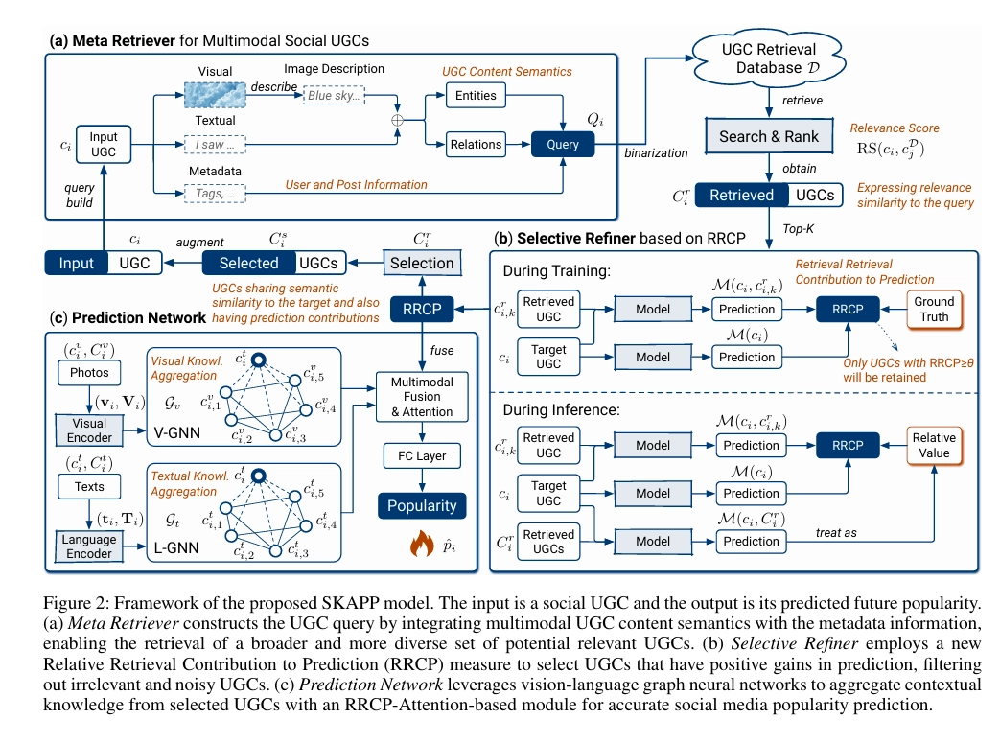

# Fussion 流程_v1
主要目的是在動畫 PV 釋出前預測 target anime 的 meanscore (迴歸)跟 popularity(迴歸)，但提供的輔助資料除了 target anime 的 meta data, covered_image, text description 以外，還有其他相關 anime 取得的 meta data。
1. 處理資料集，將 train, validation, test dataset 的 meta data 重新整理過，並且將 covered_image 分開。
1. 根據資料前處理取得 meta data，並且將 training dataset 的 meta data 存到向量資料庫當中 (這個可以討論使用什麼向量資料庫，RAG 取得meta data 的架構可以參考論文架構圖)。

2. 根據使用者要查詢的動漫名稱(或其他資訊)作為 query，從向量資料庫當中取得其他動漫相關的 meta data。
3. 透過 LLM Transformer 處理 target anime 的 text_description，並且將其轉換為向量。
4. 透過 Swim Transformer 處理 target anime 的 covered_image，並且將其轉換為向量。
5. 將從向量資料庫當中取得的 meta data 向量、target anime 的 meta data 向量、text_description 向量、covered_image 向量進行融合，並且輸入到 MLP(或是FL，目前先定這兩種，要研究) 當中，預測 target anime 的 meanscore 跟 popularity。
6. 使用 RMSE 跟 MAE 評估預測的 meanscore 跟 popularity 的準確度。(或許有其他更好的評估指標可以討論)

# Fussion 流程_v2

## 目標
在動畫 PV 釋出前，結合 target anime 的 metadata、text description embedding、cover image embedding，以及從向量資料庫檢索到的相似動畫歷史表現，預測 `meanScore`（迴歸）與 `popularity`（迴歸）。

---

## 資料準備

### 1. Fusion Metadata Dataset
從 `data/processed/anilist_anime_data_processed_v1.csv` 重新整理，保留 pre-release 已知欄位，切分成三份：
- `data/fussion/fusion_meta_train.csv`
- `data/fussion/fusion_meta_val.csv`
- `data/fussion/fusion_meta_test.csv`

保留欄位：`id`, `title_romaji`, `title_english`, `title_native`, `release_year`, `release_quarter`, `season`, `seasonYear`, `startDate_year`, `startDate_month`, `startDate_day`, `format`, `episodes`, `duration`, `source`, `countryOfOrigin`, `isAdult`, `genres`, `studios`, `is_sequel`, `has_sequel`, `prequel_count`, `prequel_popularity_mean`, `prequel_meanScore_mean`, `popularity`, `meanScore`, `popularity_quarter_pct`, `popularity_quarter_bucket`

> 註：`split_pre_release_effective` 與 `is_model_split` 保留在 processed/multimodal 表中作為資料流程控制，不納入 `fusion_meta_{split}.csv`。

### 2. Text Embedding（已完成）
- 來源：`artifacts/text_embeddings_{train/val/test}.parquet`
- 模型：`all-MiniLM-L6-v2`，384-dim
- 以 `id` 與 fusion metadata 對齊

### 3. Image Embedding（待完成）
- 來源：`data/processed/image_embeddings.parquet`（run_predict 產出）
- 模型：Swin Transformer base，1024-dim（coverImage_medium）
- 以 `id` 與 fusion metadata 對齊

---

## RAG 架構（Qdrant Hybrid Search）

### 設計原則
- 向量資料庫**只收錄 training set** 的動畫，避免 val/test leakage
- 使用 **Sparse Vector（genre + studio）** 做 soft boost，影響排名但不強制限制
- 不使用語意 embedding 作為 query vector（第一版）
- 取回 top-10 後，在 **Python 端 post-filter**：去除 `release_date >= target anime release_date` 的作品（同期或之後），取過濾後的第 1 筆

### Sparse Vector 編碼方式
將 `genres`（list）和 `studios`（list）展開成稀疏向量：
```
genres:  ["Action", "Fantasy"] → {action_idx: 1.0, fantasy_idx: 1.0}
studios: ["Bones"]             → {bones_idx: 1.0}
合併 → 單一 sparse vector（genre + studio 維度）
```

### Qdrant Collection Schema
```
collection: anime_rag
每筆文件：
  - id:            anime id
  - sparse_vector: genre + studio sparse encoding
  - payload:       { id, popularity, meanScore, release_year,
                     studios, genres, ... }  ← fusion_meta_train.csv 的欄位
```

### 查詢流程
```
for each anime in (train ∪ val ∪ test):
    query_sparse = encode_sparse(anime.genres, anime.studios)

    results = qdrant.query(
        collection   = "anime_rag",
        sparse_query = query_sparse,
        top_k        = 10,
    )

    # Python 端 post-filter：去除同期或之後的作品
    filtered = [r for r in results
                if r.payload["release_year"] < anime.release_year]

    # 取最相似的 1 筆
    top1 = filtered[0] if filtered else None
```

> **注意**：未來加入 text/image embedding 後，可升級為 dense + sparse hybrid search（Qdrant RRF fusion），soft boost 架構不變。

---

## Fusion Model

### 輸入特徵組合
```
[text_embedding]     384-dim   ← MiniLM（target anime 的 description）
[image_embedding]   1024-dim   ← Swin-base（target anime 的 cover image，待加入）
[metadata_features]  N-dim     ← 數值化後的 fusion_meta 欄位（target anime 自身）
[rag_features]       4-dim     ← top-1 相似動畫的 metadata
                                 (popularity, meanScore, release_year, studios)
```

> Meta Data 同時扮演兩個角色：直接數值化進入 Fusion Model，也作為 Qdrant sparse query 的來源（genre + studio）去檢索相似動畫。

### RAG Features 說明
Qdrant 取回 top-10，Python 端 post-filter 後取第 1 筆，直接取其 payload 欄位作為 rag_features：

| 特徵名稱 | payload 來源 | 無結果時預設值 |
|---------|-------------|--------------|
| `rag_popularity` | `popularity` | training set popularity mean |
| `rag_score` | `meanScore` | training set meanScore mean |
| `rag_release_year` | `release_year` | 0 |
| `rag_studios` | `studios` | multi-hot zeros |

> 無結果（temporal filter 後 0 筆）時以 training set global mean 填補數值欄位。

> Payload 存入 Qdrant 的欄位即為 `fusion_meta_train.csv` 的完整欄位（studios 需先 parse 成 name list）。

### Metadata 數值化
- 數值欄位（episodes, duration, release_year…）：標準化
- 類別欄位（format, source, countryOfOrigin）：one-hot 或 label encoding
- bool 欄位（isAdult, is_sequel…）：直接使用
- list 欄位（genres, studios）：multi-hot encoding

### 模型結構（第一版：MLP）
同一套架構，分別針對兩個 target 獨立訓練：

```
# Model A：預測 popularity
concat(text_emb, metadata_vec, rag_features)
    → Linear → BatchNorm → ReLU → Dropout
    → Linear → BatchNorm → ReLU → Dropout
    → Linear(1)   ← popularity

# Model B：預測 meanScore（架構相同，獨立訓練）
concat(text_emb, metadata_vec, rag_features)
    → Linear → BatchNorm → ReLU → Dropout
    → Linear → BatchNorm → ReLU → Dropout
    → Linear(1)   ← meanScore
```

---

## 評估指標
- **MAE**（Mean Absolute Error）
- **RMSE**（Root Mean Squared Error）
- **Spearman ρ**（排名相關性，對 popularity 特別重要）

popularity 另外評估 `popularity_quarter_pct`（四分位分類準確率）。

---

## 實作順序
1. 建立 `fusion_meta_{train/val/test}.csv`
2. 建立 Qdrant collection，寫入 training set
3. 對 train/val/test 執行 RAG 查詢，產出 `rag_features_{split}.parquet`
4. 數值化 metadata → `meta_features_{split}.parquet`
5. 組合所有特徵 → 訓練 MLP fusion model
6. 評估 val/test 結果